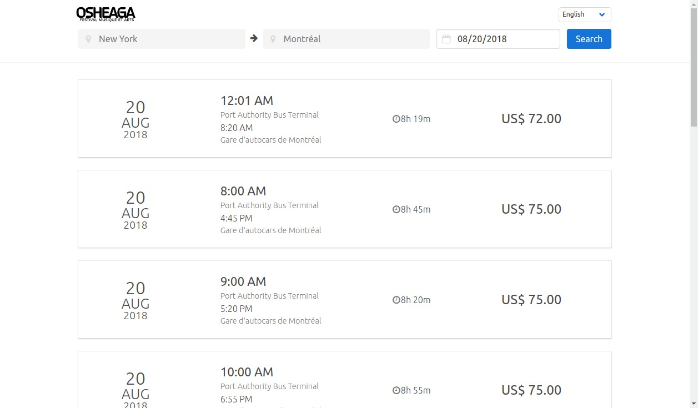

# coding-challenge-frontend-b

This is a solution for the Busbud front-end challenge.

## Running the solution

First of all it is necessary to set the environment table `REACT_APP_BUSBUD_TOKEN` with a busbud api
access token.

Then install the dependencies with

```
$> yarn
```

And run the project

```
$> yarn start
```

The project will start in your http://localhost:3000/

## Tests

Run the tests

```
$> yarn test
```

## Stack

Main libs/frameworks used:

- create-react-app
- redux-thunk
- react-i18next
- bulma
- styled-components
- jest
- moment

## Known issues

- Language picker doesn't look well in tablet resolution
- If we get an error while polling, all already fetched routes will disappear
- Date picker is the browser's default, so it may look different for different users
- Component testing needs more love

## Deploy

This solution is deployed at Heroku: https://busbud-challenge-matheusr.herokuapp.com/

## Screenshot


