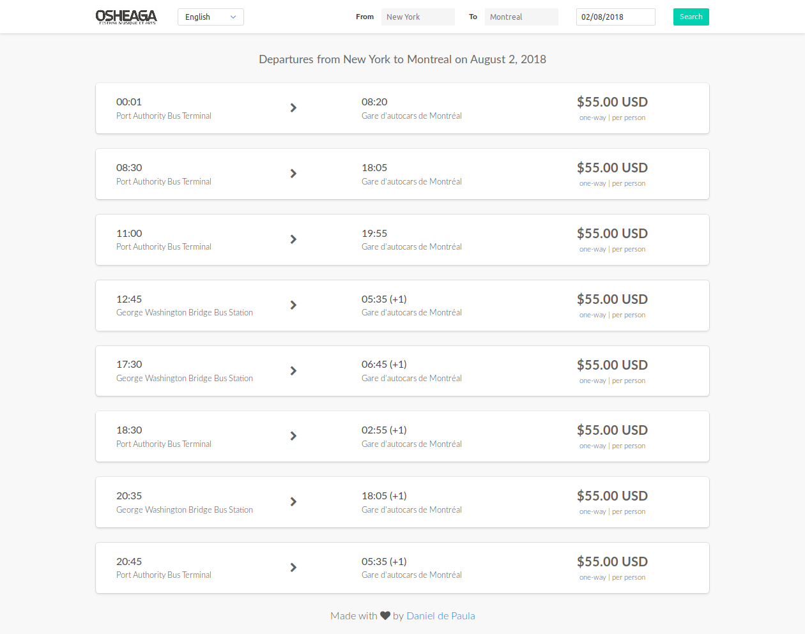

# Busbud Challenge

This is the code for my solution of the Busbud front-end challenge.

### Details
Main libraries and frameworks I used (directly):
- [create-react-app](https://github.com/facebookincubator/create-react-app): For creating the boilerplate code;
- [Bulma](https://bulma.io/): An open-source responsible CSS framework based on Flexbox;
- [axios](https://github.com/axios/axios): For the API requests;
- [react-i18next](https://react.i18next.com/): For internationalization;
- And some others (moment.js, flatpickr, eslint, eslint-airbnb, etc).  

### Development
A simple `npm install` can be used to prepare the project for development, and `npm start` to run.

**Note:** the environment variable `REACT_APP_API_TOKEN` must be declared with a valid token for the API requests. This can be done, for example, in a `.env` file added to the project root directory. 

### Depolyment
The latest version of the project has been deployed to Heroku at the following address:

https://busbud-challenge-danielpes.herokuapp.com/

For deploying separate versions, the comand `npm run build`can be used, creating all the deployable code under the `build` directory.

### Screenshot

