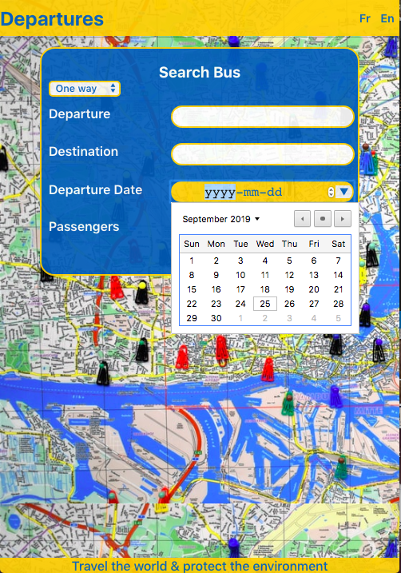
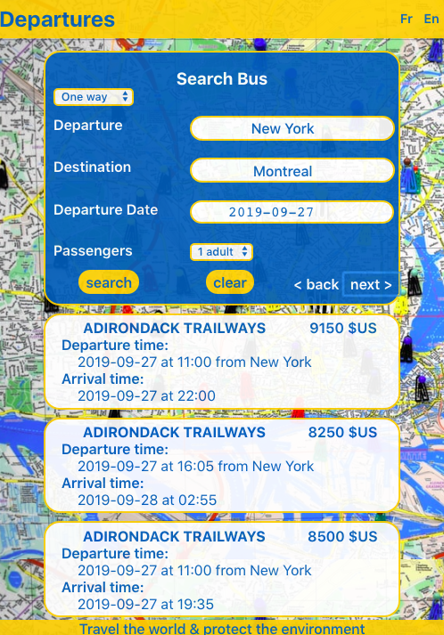
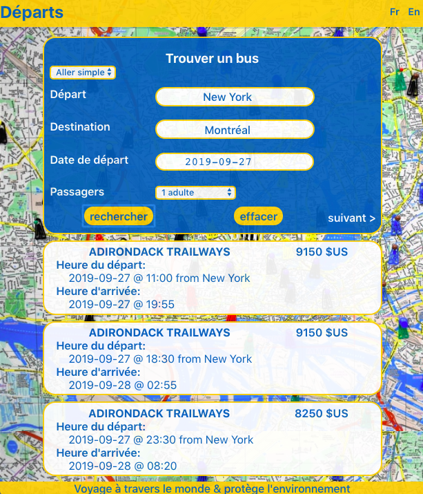

# coding-challenge-frontend-b

It will be hot this summer in Montreal with the [Osheaga festival](http://www.osheaga.com/)! 
Your challenge is to build a microsite that allows a traveler from NYC to find one-way departure schedules for the festival's opening weekend.

## Meriem's microsite:

Technologies: JavaScript, React, Redux, Github, Postman

> To start the server, run npm start
    
> Server running on port 3000 : http://localhost:3000/

> A test has been added, please look at: https://github.com/MeriemBan/coding-challenge-frontend-b/blob/master/test-translations.js

> Please find below the overview of the microsite:
    
- Search form

- Display results (English version)

- Display results (French version)

