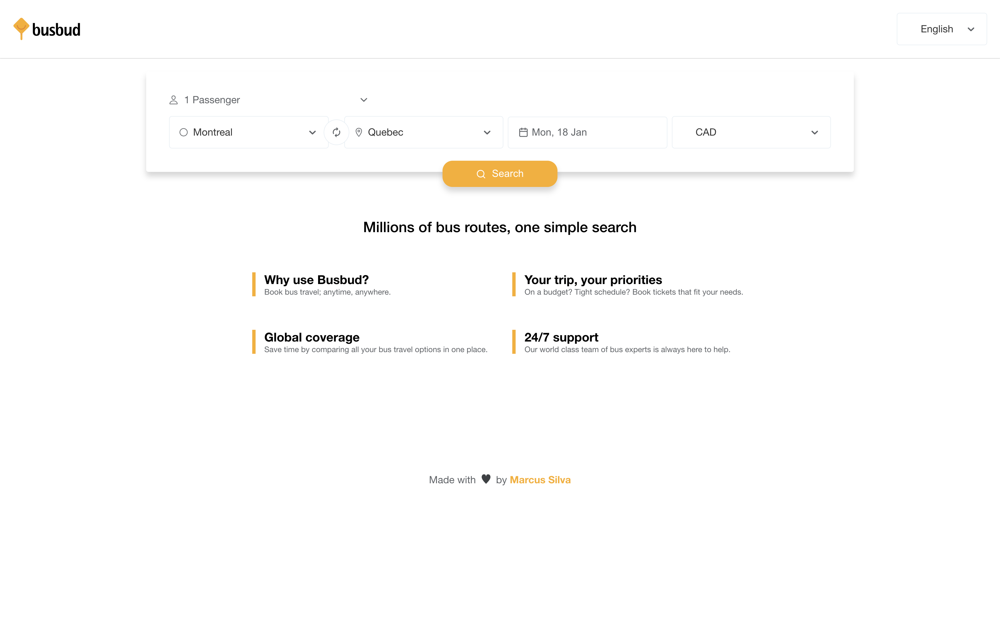

## Busbud challenge

This challenge consists in building a page to find a bus ticket using the Busbud API.

<p align="center">
  
</p>
<p align="center">
  
  
</p>

## Main Libraries
- React
- Typescript
- Testing library
- Jest
- Next 10.x.x
- Styled Components 5.x.x
- Prettier
- Server Side Rendering (SSR)
- SWR
- react i18next
- Storybook
- Date Fns

## Contributing

### 01. Install dependencies

```sh
$ yarn
```

### 02. Create configs

Create a `.env` file at the root of the project. Make sure you follow the [`.env.example`](.env.example) file as a guide.

### 03. Run the tests

```sh
$ yarn test
```

### 03. Run the project
```sh
$ yarn dev
```

### 03. Run the storybook
```sh
$ yarn storybook
```

## Respect earns Respect 👏

- Using welcoming and inclusive language
- Being respectful of differing viewpoints and experiences
- Gracefully accepting constructive criticism
- Focusing on what is best for the community
- Showing empathy towards other community members

## Author
[Marcus Silva](https://mvfsillva.dev)
